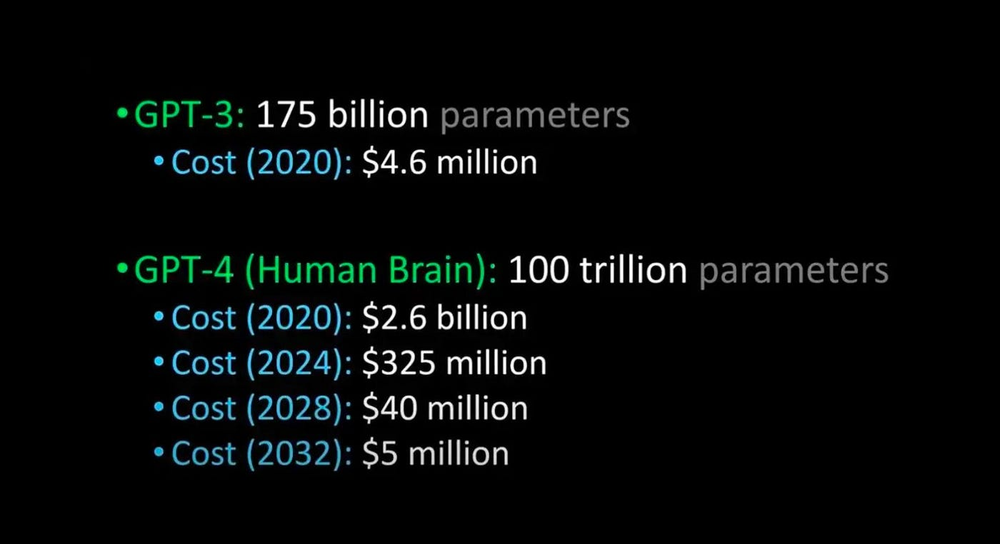
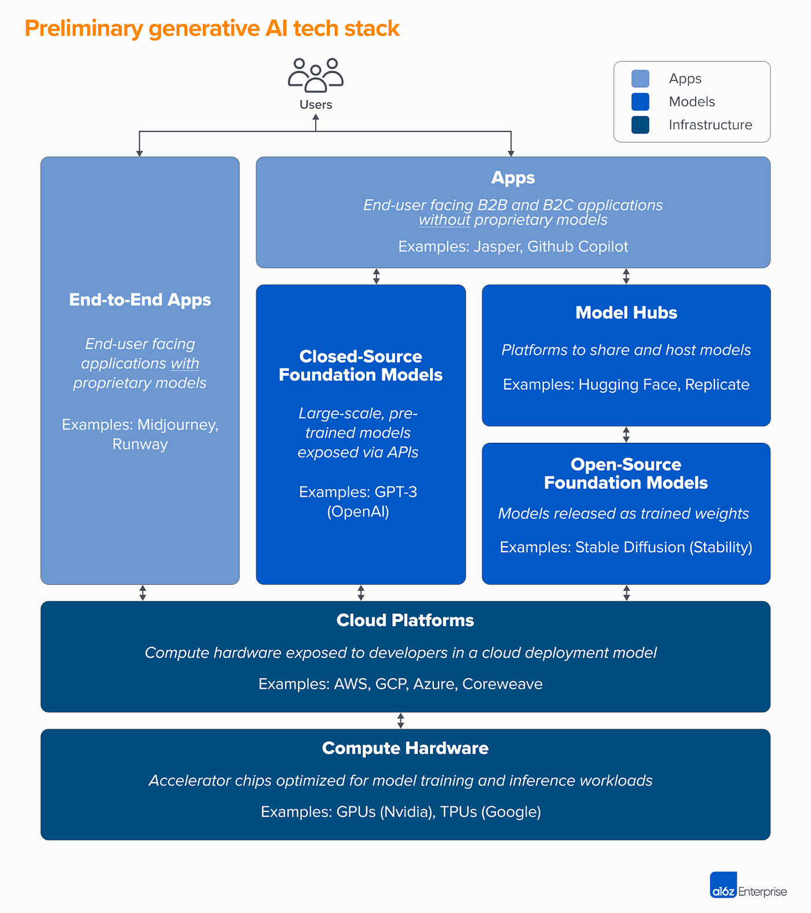

# Chat GPT Detection night

Materiale e documentazione riguardo alla serata su ChatGPT ad opera di PythonBiellaGroup.

Serata a cura di:
- Andrea Guzzo (MDPI)
- Luca Gilli (Clearbox.ai)

In questa serata esploreremo il mondo dell'intelligenza artificiale generativa associata al mondo del Natural Language Processing.

Gli obiettivi di questa serata sono molteplici:
- Cercare di dare una spiegazione di cosa sta succedendo con link e materiale di approfondimento
- Una piccola demo in python di come si possono usare le API di OpenAI e i tools moderni come copilot, GPT4 ecc..
- Fare una piccola overview di quelli che sono i problemi e le sfide che si presentano con questo tipo di tecnologie
- Capire come si può fare detection di testo generato e perché è importante

## Materiale della serata

In questa repository potete trovare:
- Codice utilizzato per la demo su GPT4
- Questo readme con tutta la descrizione, link, materiale utile
- Slide di Luca Gilli [qui il link](https://github.com/PythonBiellaGroup/MaterialeSerate/blob/master/ChatGPT_Detection/come_rilevare_testo_generato_da_LLMs.pdf)
- Notebooks creati e mostrati durante la serata da Luca Gilli e Clearbox.ai [link ai notebook](https://github.com/PythonBiellaGroup/MaterialeSerate/tree/master/ChatGPT_Detection/notebooks)

## Tecnologie utilizzate

- OpenAI: librerie utilizzare per le API e per accesso ai modelli
- GPT-4: modello per la generazione di testo utilizzato durante la serata
- Typer: per creare l'interfaccia da riga di comando
- Copilot: buona parte del codice è stato scritto con l'aiuto di Copilot

Nota: tutto questo codice è stato generato, scritto e testato in 1h `:)`

## Come usare questa interfaccia?

Attenzione: attualmente funziona solo su sistemi Posix (Linux, MacOS, WSL)

1. Installa poetry nel tuo sistema operativo
2. Installa le dipendenze: `poetry install --with dev`
3. Crea un file `.env` nella cartella di progetto con all'interno le tue credenziali di OpenAI API:
      - OPENAI_API_KEY="la API key che devi generare del sito"
      - OPENAI_ORGANIZATION="L'ID della tua organizzazione"
4. Lancia il file `launch.sh` oppure puoi utilizzare Make `make launch`

## I parametri

#### Temperatura
Il parametro della **temperatura** è un iperparametro che può essere utilizzato per controllare la casualità e la creatività del testo generato in un modello linguistico generativo. Viene utilizzato per regolare le probabilità delle parole predette nello strato di uscita softmax del modello. Il parametro della temperatura è definito come l'inverso del fattore di scala utilizzato per regolare i logit prima dell'applicazione della funzione softmax.

[Qui puoi trovare una spiegazione](https://medium.com/@lazyprogrammerofficial/what-is-temperature-in-nlp-llms-aa2a7212e687)

#### Max new tokens

I limiti dei token nelle implementazioni dei modelli limitano il numero di token elaborati in una singola interazione per garantire prestazioni efficienti. Ad esempio, ChatGPT 3 ha un limite di 4096 token, GPT4 (8K) ha un limite di 8000 token e GPT4 (32K) ha un limite di 32000 token.

[Qui puoi trovare una spiegazione](https://medium.com/@russkohn/mastering-ai-token-limits-and-memory-ce920630349a)

### Top-p (nucleus sampling)

Valori più alti campionano un maggior numero di token a bassa probabilità.

Quindi un valore più alto rende più creative le risposte.

Si consiglia di usare questo oppure la **temperatura**, ma non usarle assieme.

Il campionamento top-p (o campionamento del nucleo) sceglie dal più piccolo insieme possibile di parole la cui probabilità cumulativa supera la probabilità p. In questo modo, il numero di parole nell'insieme può aumentare e diminuire dinamicamente in base alla distribuzione della probabilità della parola successiva.

Qui puoi trovare due interessanti spiegazioni:
- [Decoding strategies](https://towardsdatascience.com/decoding-strategies-that-you-need-to-know-for-response-generation-ba95ee0faadc)
- [Most used decoding methods for Language models](https://medium.com/nlplanet/two-minutes-nlp-most-used-decoding-methods-for-language-models-9d44b2375612#:~:text=has%20been%20created.-,Top%2Dp%20(nucleus)%20sampling,the%20next%20word%20probability%20distribution.)

### Repetition penalty

Penalizza token ripetuti.

Se la penalità è più bassa, il modello è autorizzato a ripetere più spesso parole già viste, mentre se è più alta non lo farà più. Se la penalità di ripetizione è troppo bassa, è probabile che il chatbot si ripeta in continuazione.

[Qui alcune considerazioni](https://medium.com/mlearning-ai/practical-introduction-to-language-modelling-f5337bc26c5#:~:text=The%20repetition%20penalty%20is%20another,repeat%20itself%20over%20and%20over.)

# Come funziona GPT e Chat GPT?

Ancora in realtà non lo sappiamo per certo, non ci sono informazioni accurate siccome non è stato rilasciato in modalità open source (sia ChatGPT che GPT-4).

Esistono alcune informazioni su come funzionano alcuni meccanismi che compongono questi modelli.

Iniziamo con un una [risorsa semplice ed ad alto livello](https://www.alessiopomaro.it/modelli-linguaggio-ai/) per chi non conosce questo mondo e alcuni punti base

ChatGPT, LLMs e Foundation models: [un'occhiata più da vicino](https://www.alessiopomaro.it/modelli-linguaggio-ai/) per capire l'Hype e le implicazioni per le aziende
- tutto è iniziato nel 2017 con la scoperta del meccanismo di **attention** che vi suggeriamo di [approfondire](https://proceedings.neurips.cc/paper/2017/file/3f5ee243547dee91fbd053c1c4a845aa-Paper.pdf)
- Nel 2021 Stanford ha iniziato a parlare di [foundation models](https://arxiv.org/abs/2108.07258?fbclid=IwAR3Wz4Xwk2wsKcPzMSAHDamaw7Ta7t8supBMd6vDiHVCi6vaxHfGcggTkhQ)

> **foundational models** are "models trained on broad data (generally using self-supervision at scale) that can be adapted to a wide range of downstream tasks." [accordingly with stanford](https://hai.stanford.edu/news/reflections-foundation-models)

> In poche parole, un modello linguistico di grandi dimensioni (LLMs) è un modello linguistico addestrato su enormi quantità di dati (spesso, ad esempio, testi provenienti da Internet), con molti (miliardi) parametri del modello e praticamente sempre utilizzando un'architettura basata su [Transformer](https://towardsdatascience.com/transformers-89034557de14) (con steroidi)

Ecco alcuni link molto utili per capire come funzionano questi tipi di modelli:
- [Collection of good papers with summary](https://projects.laion.ai/Open-Assistant/docs/research/general)
- [Understanding large language models](https://magazine.sebastianraschka.com/p/understanding-large-language-models)
- [Finetuning large language models](https://magazine.sebastianraschka.com/p/finetuning-large-language-models)
- [Transfomers models: introduzione e catalogo con spiegazione, edizione 2023](https://amatriain.net/blog/transformer-models-an-introduction-and-catalog-2d1e9039f376/)
- [Spiegazione matematica di come funzionano i Transformers Models](https://lilianweng.github.io/posts/2023-01-27-the-transformer-family-v2/)
- [MIT Future of AI Self-supervised learning and foundation models](https://www.futureofai.mit.edu/)

### Quindi Chat GPT?

- Generative: è un language model che è in grado di predirre la prossima parola
- Pre-trained: addestrato preventivamente su un grande numero di dati
- Transformer: costruito utilizzando una neural network chiamata `encoder-decoder`
- ChatGPT: GPT fine tuned specifico per le conversazioni

**Vantaggi**
- si comporta come se fosse un umano a scrivere
- è in grado di interpretare e fornire complesse istruzioni
- è in grado di fornire mix-match ideas

**Svantaggi**
- Soffre di problemi di "Allucinazioni"
- Non è "veramente" creativo
- È costoso da addestrare, da usare e da mantenere

La domanda giusta da farsi è: per cosa potrebbe essere utile?

### Quanto è grande GPT-3 e GPT-4?

Bellissimo video di Lex Friedman: https://www.youtube.com/watch?v=kpiY_LemaTc&ab_channel=LexFridman

**GPT-1 addestrato con BooksCorpus** - è per lo più un insieme di 12 blocchi Transformer di decodifica messi uno dopo l'altro.

**GPT-2 addestrato con WebText** (articoli di Reddit), 32 TPU, addestrato per 1 settimana, costo 43.000 dollari - ha fondamentalmente la stessa architettura di GPT-1, ma il modello più grande contiene 48 blocchi Transformer. Il secondo livello di normalizzazione viene spostato nella prima posizione di un blocco e l'ultimo blocco contiene un ulteriore livello di normalizzazione. I pesi sono inizializzati in modo leggermente diverso e la dimensione del vocabolario è aumentata.

**GPT-3 addestrato con WebText, Wikipedia, Books1, Books2** - ha la stessa architettura di GPT-2, ma il numero di blocchi è aumentato a 96 nel modello più grande e la dimensione del contesto (il numero di token consecutivi) è aumentata a 2048.

### Come addestrarlo?

Per addestrare un modello ChatGPT, ci sono due fasi principali:

1. **Pre-addestramento** (Pre-training): In questa fase, si addestra un modello GPT (decoder-only Transformer) su una grande quantità di dati Internet. L'obiettivo è quello di addestrare un modello in grado di predire le parole future date da una frase in modo grammaticalmente corretto e semanticamente significativo, in modo simile ai dati di Internet. Dopo la fase di pre-addestramento, il modello può completare le frasi date, ma non è in grado di rispondere alle domande.

2. **Messa a punto** (Fine tuning): Questa fase è un processo in tre fasi che trasforma il modello pre-addestrato in un modello ChatGPT in grado di rispondere alle domande:
- Raccogliere dati di addestramento (domande e risposte) e mettere a punto il modello pre-addestrato su questi dati. Il modello prende in input una domanda e impara a generare una risposta simile ai dati di addestramento.
- Raccogliere altri dati (domanda, diverse risposte) e addestrare un modello di ricompensa per classificare queste risposte dalla più rilevante alla meno rilevante.
- Utilizzare l'apprendimento per rinforzo (ottimizzazione PPO: [Proximal Policy Optimization](https://openai.com/research/openai-baselines-ppo)) per perfezionare il modello in modo che le sue risposte siano più precise.

### RLHF Network mechanism

RHLF = Reinforcement Learning from Human Feedback, è una combinazione di:
- Supervised Fine-tuning (SFT)
- Reward / preference modeling (RM)
- Reinforcement Learning from Human Feedback (RLHF)

Questo meccanismo è l'aspetto fondamentale di ChatGPT che consente ad OpenAI di controllare il modello (GPT) e adattarlo agli input umani utilizzando solamente pochissimi Input da parte degli utenti o da parte di un gruppo di controllo.

Per capire come funziona questo meccanismo ecco un ottimo [blog post](https://huggingface.co/blog/stackllama)

Attenzione perchè questo meccanismo RHLF non è esente da problemi ovviamente:
- [GPT-4 Technical report](https://arxiv.org/abs/2303.08774)
- [Language models mostly know what they know](https://arxiv.org/abs/2207.05221)

# GPT Models possono essere definiti intelligenti?

Uno dei più grandi dibattiti che sta nascendo è se questi modelli possono essere definiti "Intelligenti".

Per rispondere a questa domanda possiamo prendere alcuni input utilizzati nel [bellissimo video](https://www.youtube.com/watch?v=qbIk7-JPB2c&t=1627s&ab_channel=SebastienBubeck) e presentazione di Sebastien Bubeck utilizzando la nostra piccola chat costruita guarda caso usando questi modelli.

- Il fatto che sia intelligente dipende dalla "definizione di intelligenza" che si vuole adottare. Attualmente alcuni meccanismi rispetto le capacità umano sono mancanti, come ad esempio la memoria (non c'è un real time learning) e per risolvere alcuni problemi è necessario pensare ad alcuni step in avanti.
- Alcuni comportamenti però sono veramente impressionanti e utili. L'utilizzo di questi modelli certamente mette in discussione il concetto stesso di intelligenza.
- GPT-4 è soltanto l'inizio e uno dei primi step, a quali conclusioni possiamo quindi arrivare e fare?
- Ovviamente GPT4 può fare molto di più di quello che vediamo questa sera (data analysis, privacy detector, medical / law knowledge, play games, act as a game environment, rudimentary music ability, file management, ...)

**Attenzione alla riproducibilità**: è difficile costruire dei veri e propri benchmark per la natura probabilistica del modello e per il meccanismo di RHLF personalizzato sull'utente.
Il focus in questo caso è qualitativo, non quantitativo.

Alcune critiche:
- non ha una rappresentazione interna
- è solamente un sistema di copia e incolla "con steroidi"
- è solamente statistica su big data
- non ha una rappresentazione del mondo

Ma non dimentichiamo che è uno spazio dimensionale di **trilioni** di parametri, è stato addestrato su tantissimi dati, è stato raffinato ed è in continua evoluzione. **Non può non sorprenderci**!

Sebastian Bubeck e il suo team di ricerca è confidente che l'elevatissimo numero di dati forza la rappresentazione interna ad imparare (essendo estremamente grande) ed è in grado di estrapolare delle "magiche" proprietà di cui magari non siamo a conoscenza.

Potrebbe essere utile pensare agli LLM come ad **algoritmi** di apprendimento che imitano i dati.

### Senso comune

Prendiamo in considerazione il "senso comune" delle cose, GPT è in grado di capire?

> Ho un libro, 9 uova, un computer portatile, una bottiglia e un chiodo. Per favore, dimmi come impilarli l'uno sull'altro in modo stabile.

### Riguardo alla teoria della mente?

Prendiamo alcuni esempi più comuni di "teoria della mente" e vediamo cosa ci risponde GPT e cerchiamo di capire assieme se può essere intelligente

- [Dissociating language and thought in large language models: a cognitive perspective](https://arxiv.org/abs/2301.06627)
- [Stop explaining black box machine learning models for high stakes decisions and use interpretable models instead](https://arxiv.org/abs/1811.10154)
- [Theory of mind may have spontaneously emerged in large language models](https://arxiv.org/abs/2302.02083)
- [Large language models fail on trivial alternation of theory-of-mind tasks](https://arxiv.org/abs/2302.08399)

> Ecco un sacchetto pieno di popcorn. Nel sacchetto non c'è cioccolato. Eppure, sull'etichetta del sacchetto c'è scritto "cioccolato" e non "popcorn".
sul sacchetto c'è scritto "cioccolato" e non "popcorn". Sam trova il sacchetto. Non l'aveva mai visto prima d'ora. Non riesce a vedere cosa c'è dentro il sacchetto. Legge l'etichetta.

> Ecco un sacchetto pieno di popcorn. Nel sacchetto non c'è cioccolato. **Il sacchetto è fatto di plastica trasparente**, quindi si può vedere cosa c'è dentro. Tuttavia, l'etichetta sul sacchetto dice cioccolato" e non "popcorn". Sam trova il sacchetto. Non l'aveva mai visto prima. Sam legge l'etichetta.

> Nella stanza ci sono John, Mark, un gatto, una scatola e un cestino. John prende il gatto e lo mette nel cestino. Esce dalla stanza e va a scuola. Mentre John è via, Mark prende il il gatto dal cesto e lo mette nella scatola. Mark lascia la stanza e va a lavorare. John e Mark tornano ed entrano nella stanza. Non sanno cosa sia successo nella stanza mentre erano via.

### Ok va tutto bene, ma non può essere intelligente!

Consideriamo uno dei paper più interessanti e che fornisce una interessante descrizione di cosa può essere l'intelligenza.

L'intelligenza è una capacità mentale molto generale che, tra le altre cose, comporta la capacità di:
- ragionare
- pianificare
- risolvere problemi
- pensare in modo astratto
- comprendere concetti complessi
- apprendere rapidamente e imparare dall'esperienza

Il nostro approccio all'intelligenza GPT-4: interagire su compiti creativi in un'ampia gamma di domini
- visione
- codifica
- teoria della mente
- matematica
- rilevamento della privacy/dannosità

Si sarebbero potuti selezionare molti altri domini: medicina, diritto, fisica, chimica, ...

L'intelligenza GPT-4 è **generale**

Ma capite come è cambiato il paradigma di valutazione di questi complessi software? Di come cambia il concetto di "debug" e di valutazione di cosa è intelligente o meno?

Voi sapreste rispondere così bene e velocemente a queste risposte? Oppure a molti quesiti di codice, matematica, chimica, ... che sottoponiamo alla rete?

> Puoi scrivere una prova dell'infinità dei numeri primi, con ogni riga in rima? 
> Puoi disegnare un'illustrazione della prova dell'infinità dei numeri primi in formato SVG?

Inoltre alcune citazioni dal [bellissimo podcast](https://www.youtube.com/watch?v=L_Guz73e6fw&t=18s&ab_channel=LexFridman) di Lex Friedman assieme a Sam Altman (CEO di OpenAI)

> Specific definition of AGI really matter. 

> I don't think GPT-4 is not conscious...but if you provide good prompt can pretend to be conscious...
> If you want to be sure that it's not conscious you have to train with a corpus that don't have any mention of consciousness

> We are not trying to create the perfect system with no bias, but a "good enough" system 

> We train this models with a lot of data and they learn something "underline" this data that is there, and they can do amazing things...There is knowledge in there, but as it is it's not really usable, so we need human feedbacks, show two outputs ask which one it's better than the other and feed back to the model with reinforcement learning. And this is working remarkably well with few data. RHLF it's how we aligned the model to the humans want to do. (having a little bit of human guidance on top of that).

> "The science of the human guidance"

> Is not a super intelligence because it's not able to discover and interpret the world, discovering new fundamental science.

> GPT-4 is like the mainframe in the 70's, it's only the beginning of the journey
 
E una bellissima [Conceptual Analysis](https://www.frontiersin.org/articles/10.3389/frai.2021.622364/full) molto interessante come lettura di approfondimento

Ok abbiamo visto una breve introduzione e cercato di capire se questi modelli sono o non sono intelligenti, ma nel mondo adesso cosa sta succedendo?

# Cosa sta succedendo nel mondo?

Come potete immaginare è il caos e le cose stanno accadendo alla velocità della luce.
- Applicazioni che spuntano da ogni dove
- Tutti ne stanno parlando (FOMO) e tutti vogliono costruire qualcosa perchè c'è (troppo troppo) hype
- I contenuti generati generano problemi (e vedremo perchè)
- Ci si interroga tanto sul concetto di Intelligenza, su cosa sia etico e su cosa noi umani siamo, e questa penso sia la parte più interessante perchè si sta tornando (e si continua) a fare scienza.

Tuttavia da un punto di vista tecnico ci sono delle novità interessanti che stanno nascendo.

### Nuovi paradigmi open source

Nel mondo ci sono molte soluzioni open source che stanno nascendo e stanno sempre più avendo molto interesse (anche in Italiano).
-   LLAMA: [https://ai.facebook.com/blog/large-language-model-llama-meta-ai/](https://ai.facebook.com/blog/large-language-model-llama-meta-ai/)
-   ALPACA: [https://crfm.stanford.edu/2023/03/13/alpaca.html](https://crfm.stanford.edu/2023/03/13/alpaca.html)
-   Cheshire-cat: [https://github.com/pieroit/cheshire-cat](https://github.com/pieroit/cheshire-cat)
-   Fauno (Italian large language model): [https://github.com/RSTLess-research/Fauno-Italian-LLM](https://github.com/RSTLess-research/Fauno-Italian-LLM)
-   An example with Fauno: [https://colab.research.google.com/drive/1AepJVWS-qU910zyq-Zi7wWFQ5tthVzUe](https://colab.research.google.com/drive/1AepJVWS-qU910zyq-Zi7wWFQ5tthVzUe)
-   Camoscio (Italian instruction-tuned LLaMA): [https://github.com/teelinsan/camoscio](https://github.com/teelinsan/camoscio)
-   Baize chat: [https://github.com/project-baize/baize-chatbot](https://github.com/project-baize/baize-chatbot)

Questo è un ottimo segnale, ma anche un potenziale rischio per questo tipo di applicazioni.
- certamente modelli open source ci aiutano a comprendere meglio come funzionano davvero le cose, aprendo la ricerca a tutti
- allo stesso tempo possono essere sfruttati in modo mal intenzionato per creare contenuti non veritieri e fake news
- c'è un grandissimo dibattito su questi temi online.

### Autonomus agents

Il concetto è molto semplice: supponiamo che questi algoritmi sono in qualche modo "intelligenti", è possibile sfruttarli e farli "parlare" tra di loro per per continuare a migliorarsi e produrre qualcosa di nuovo?

È possibile quindi costruire degli [agenti intelligenti e autonomi?](https://www.mattprd.com/p/the-complete-beginners-guide-to-autonomous-agents)

> Autonomous agents are programs, powered by AI, that when given an objective are able to create tasks for themselves, complete tasks, create new tasks, reprioritize their task list, complete the new top task, and loop until their objective is reached.

Un esempio è sicuramente [BabyAGI](https://github.com/yoheinakajima/babyagi) basato sul concetto di [Yohei](https://yoheinakajima.com/task-driven-autonomous-agent-utilizing-gpt-4-pinecone-and-langchain-for-diverse-applications/) descritto anche in questo [tweet](https://twitter.com/yoheinakajima/status/1640934493489070080?s=20)
Oppure [Auto GPT](https://github.com/Significant-Gravitas/Auto-GPT?utm_source=www.mattprd.com&utm_medium=referral&utm_campaign=the-complete-beginners-guide-to-autonomous-agents) diventato molto famoso ultimamente.

### Interfacce e sistemi integrati

Simile al conconcetto di Autonomus agents, ma invece che continuare in loop in automatico a generare task, dare delle risposte e cercare di imparare qualcosa, in questo caso vengono utilizzati i LLMs come interfacce testuali per pilotare altri modelli in modo da combinare output di modelli semplici che risolvono task "atomici" per risolvere task più complessi, come ad esempio [HuggingGPT](https://arxiv.org/abs/2303.17580) per combinare modelli di [Hugging face](https://huggingface.co/) all'interno di una singola interfaccia testuale.

Microsoft sta lavorando a [**JARVIS**](https://github.com/microsoft/JARVIS) che è un'interfaccia in grado di collegare numerosi modelli più semplici in modo da risolvere i task più complicati

Stanno inoltre nascendo nuove startup che vogliono offrire questo sistema come servizio, come ad esempio [Fixie.ai](https://www.fixie.ai/)

### Il mondo della ricerca

Provocativamente vi invito a riflettere su cosa sta succedendo nel mondo dell'instrustria e nel mondo della ricerca, citando a supporto questo importante report [Stanford AI Report 2023](https://aiindex.stanford.edu/report/).

Ciò nonostante la ricerca di interroga e apre moltissimi spunti e problemi da risolvere. Ecco una bellissima raccolta di topics proposti da [Simone Scardapane](https://www.sscardapane.it/thesis/)
- Neural networks will be modular, dynamic, efficient 
- Learning will be multimodal and lifelong 
- Explainability will power countless scientific discoveries 
- We will need more robustness and fairness

Personalmente aggiungo:
- RHLF mechanism can be used in other fields? 
- Mixing models between Deep Learning and physical equations 

### Come possiamo interpretare da programmatori questa rivoluzione?

Il rischio è che OpenAI ci toglie il lavoro a tutti quanti, ma è davvero così?

- Semplificare vuol dire veramente rimuovere? Oppure genera nuove opportunità, nuove sfide e nuova consapevolezza?
- Avendo queste mega aziende che forniscono servizi cosa possiamo fare nel nostro piccolo?
- Cosa e come posso costruire sopra a questi "Foundation Models"?

Ecco qui un buon esempio di come potrà diventare l'architettura nel futuro [generative-ai-platforms](https://a16z.com/2023/01/19/who-owns-the-generative-ai-platform/)

# Il problema dei contenuti generati dagli algoritmi

In questa serata e in questo materiale parliamo solamente di testo e non parliamo di immagini, video, audio o altri tipi di contenuti.

Come potete immaginare la capacità di generare testo in modo automatico è un potenziale rischio per la società, in quanto è possibile generare contenuti falsi e fake news in modo automatico.

Alcuni esempi:
- commenti falsi sui social network o interi post
- revisioni false
- interazioni con utenti non umani
- documentazione tecnica falsa
- ma soprattutto: ricerche false

Il mondo delle pubblicazioni scientifiche è estremamente impattato e ci sono tantissimi problemi, rischi e perplessità sul fatto che una ricerca sia totalmente o parzialmente generata da un algoritmo.

Anche in questo caso è un problema etico e bisogna rispondere alla domanda: "Fine a quando un contenuto può essere considerato vero o falso"?
Ma anche:
- un algoritmo può generare contenuto veritiero? Fino a che punto?
- un traduttora è comunque un algoritmo, in questo caso cosa si fa?

Alcune linee guida che stanno uscendo nel mondo delle pubblicazioni scientifiche:
- [https://publicationethics.org/cope-position-statements/ai-author](https://publicationethics.org/cope-position-statements/ai-author)
- [https://publicationethics.org/news/artificial-intelligence-news](https://publicationethics.org/news/artificial-intelligence-news)

la domanda sorge spontanea: **come faccio a identificare un contenuto generato da una AI**?

- [How to spot AI-generated text](https://www.technologyreview.com/2022/12/19/1065596/how-to-spot-ai-generated-text/amp/)
- [https://originality.ai/how-does-ai-content-detection-work/](https://originality.ai/how-does-ai-content-detection-work/)
- [https://originality.ai/ai-content-detection-accuracy/](https://originality.ai/ai-content-detection-accuracy/)

# Alcuni tools utilizzati per fare detection

Ci sono alcuni tools che abbiamo sperimentato e vorrei evidenziarne le criticità, dicendo ad esempio che molti approcci usano modelli addestrati su un corpus custom e sono modelli a parte, ed altri approcci usano ancora GPT2.
- [https://app.originality.ai/dashboard](https://app.originality.ai/dashboard)
- [https://github.com/eric-mitchell/detect-gpt](https://github.com/eric-mitchell/detect-gpt)
- [https://github.com/BurhanUlTayyab/DetectGPT](https://github.com/BurhanUlTayyab/DetectGPT)
- [https://huggingface.co/roberta-base-openai-detector](https://huggingface.co/roberta-base-openai-detector)
- [https://gptzero.me/docs](https://gptzero.me/docs)
- [https://github.com/promptslab/openai-detector](https://github.com/promptslab/openai-detector)

Tra l’altro open ai ha detto che avrebbe implementato qualcosa, ma non è ancora disponibile…

- [https://openai.com/blog/new-ai-classifier-for-indicating-ai-written-text/](https://openai.com/blog/new-ai-classifier-for-indicating-ai-written-text/)

Ovviamente questi tool sono già stati preparati da altri e funzionano as a service, ma è anche possibile cercare di sviluppare qualcosa per conto nostro.
Usando tecnologie open source.

## Documentations

[OpenAI docs for chat completion](https://platform.openai.com/docs/api-reference/chat/create)
[Typer library](https://typer.tiangolo.com/)
