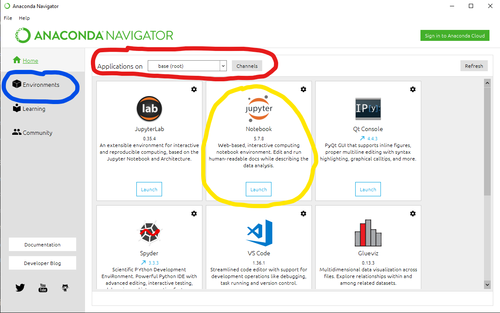

# Setup dell'ambiente e degli strumenti di lavoro

Questo breve documento vi insegnerà le basi degli ambienti di lavoro necessari per questo corso.

# Installare Python

Cos'è Python?  
https://docs.python.org/3/tutorial/index.html

Python è un linguaggio di programmazione potente e facile da imparare. Ha efficienti strutture dati di alto livello e un approccio semplice ma efficace alla programmazione orientata agli oggetti. L'elegante sintassi e la tipizzazione dinamica di Python, insieme alla sua natura interpretativa, ne fanno un linguaggio ideale per lo scripting e il rapido sviluppo di applicazioni in molte aree della maggior parte delle piattaforme.

L'interprete Python e l'ampia libreria standard sono liberamente disponibili in forma sorgente o binaria per tutte le principali piattaforme dal sito web Python, https://www.python.org/, e possono essere liberamente distribuiti. Lo stesso sito contiene anche distribuzioni e puntatori a molti moduli Python di terze parti gratuiti, programmi e strumenti, e documentazione aggiuntiva.

L'interprete Python è facilmente estensibile con nuove funzioni e tipi di dati implementati in C o C++ (o altri linguaggi richiamabili da C). Python è anche adatto come linguaggio di estensione per applicazioni personalizzabili.

Cosa si può fare con Python? Quasi tutto, e la maggior parte delle cose abbastanza facilmente. Argomenti come l'analisi dei dati, l'apprendimento automatico, lo sviluppo web, le applicazioni desktop, la robotica e altro ancora sono tutte cose che si possono immediatamente iniziare a fare con Python senza troppa fatica. Personalmente, ho usato Python per addestrare alcune IA, per aiutare le aziende a rilevare le malattie, per aiutare a individuare frodi e abusi contro i server, per creare giochi, per scambiare azioni, e ho costruito e aiutato a costruire molteplici attività con Python.  
Python, ma più in generale la programmazione, è lo strumento del nostro secolo che vi consente di lavorare con i computers su qualsiasi applicazione e a qualsiasi livello!  \
https://pythonprogramming.net/introduction-learn-python-3-tutorials/  

Se volete installare il pitone sulla vostra macchina, potete scaricarlo da qui: https://www.python.org/downloads/  
La versione python usata in questo corso è il python 3.6 perché è più versatile per tutte le biblioteche di Data Science usate in questo corso.

In alcune macchine (mac, linux) sarà installata di default la versione 2.7 di python, vi chiediamo di non usare la versione 2.x per problemi di incompatibilità.  

Installate la versione base dal sito web se volete iniziare a giocare con python!

## Anaconda

- Cos'è l'anaconda
- Installare
- GUI vs linea di comando

Anaconda è una distribuzione open source dei linguaggi di programmazione Python e R ed è utilizzato nella scienza dei dati, nell'apprendimento automatico, nelle applicazioni di apprendimento profondo che mirano a semplificare la gestione e la distribuzione dei pacchetti.

La distribuzione Anaconda è usata da oltre 7 milioni di utenti, e comprende più di 300 pacchetti di scienza dei dati adatti a Windows, Linux e MacOS.

Contiene tutti i pacchetti necessari per iniziare a sviluppare con Python ed è la distribuzione che raccomandiamo perché è molto facile da imparare e da usare.

Se vuoi installare Anaconda scarica la versione 3.X da qui: https://www.anaconda.com/distribution/

L'Anaconda ha due tipi di interazione:
- Approccio grafico
- Approccio basato su terminale

L'approccio grafico è con l'Anaconda Navigator una GUI che può aiutare ad utilizzare gli strumenti



Nell'immagine qui sopra puoi vedere alcune parti diverse:
- La parte blu: è dove puoi gestire alcuni diversi ambienti python-conda (ne parleremo nel prossimo cpt.)
- La parte rossa: è dove è possibile modificare gli ambienti installati e le relative app
- La parte gialla: sono le app installate in un ambiente specifico che puoi usare

Se apri la parte blu (ambienti) puoi trovare tutti gli ambienti, tutti i pacchetti e puoi creare nuovi ambienti, pacchetti e librerie o disinstallare e gestire gli altri già in


Il modo migliore per usare anaconda è con il terminale, dopo l'installazione apri CMD (o la tua app terminale) e puoi interagire con Anaconda usando il comando: conda


Ecco qualche utile comando:

- Informazioni sull'installazione di Conda

- Per vedere i tuoi ambienti

- Elenco dei pacchetti nei tuoi ambienti

- Aggiorna anaconda

### Virtual Environments

- Che cos'è un ambiente virtuale
- Crea un nuovo ambiente virtuale
- Installa i pacchetti python in librerie e pacchetti (conda vs pip)
- Cambia ambiente e usa ambienti diversi

Lo scopo principale degli ambienti virtuali Python (chiamato anche venv) è quello di creare un ambiente isolato per i progetti Python.
Ciò significa che ogni progetto può avere le proprie dipendenze, indipendentemente dalle dipendenze di ogni altro progetto.

Nel nostro piccolo esempio qui sopra, avremmo solo bisogno di creare un ambiente virtuale separato sia per ProjectA che ProjectB, e saremmo pronti a partire.
Ogni ambiente, a sua volta, sarebbe in grado di dipendere da qualunque versione di ProjectC scelga, indipendentemente dall'altro.

Il bello di questo è che non ci sono limiti al numero di ambienti che puoi avere dato che sono solo directory che contengono alcuni script.
Inoltre, possono essere facilmente creati utilizzando gli strumenti da riga di comando virtualenv o pyenv.

È possibile creare un ambiente virtuale con Python predefinito, ma utilizziamo ambienti con Anaconda.
Per informazioni standard su Python relative agli ambienti virtuali, vedere questo link di seguito: \
https://realpython.com/python-virtual-environments-a-primer/

Ecco alcuni utili comandi da utilizzare con Anaconda per creare, controllare, validare e aggiornare un Conda Venv

ATTENZIONE: se sei su Windows, usa CMD (come amministratore se possibile) e cerca di evitare Powershell fino a quando non sei sicuro di questa tecnologia

__Per visualizzare le informazioni di Conda sull'installazione__

```Bash
conda -v
```

__Controllare che Anaconda sia aggiornato__
```bash
conda update conda
```

__Crea un nuovo ambiente virtuale (venv) con una specifica versione di Python__ \
Ricorda di sostituire x.x con la tua versione di Python (usiamo principalmente la versione 3.6) e "yourenvname" con il nome del tuo ambiente
```Bash
conda create -n yourenvname python = x.x anaconda
```

Se vuoi creare un ambiente vuoto senza le librerie di conda predefinite puoi fare:
```Bash
conda create -n nomeutente python = x.x
```
senza l'etichetta anaconda

__Attivare l'ambiente di Anaconda__
```bash
conda activate yourenvname
```

__Per installare un nuovo pacchetto nel tuo nuovo ambiente puoi ...__
```Bash
conda install -n nomeutente [pacchetto]
```

ma se sei già nel tuo ambiente conda puoi semplicemente fare:
```Bash
conda install [pacchetto]
```

* sempre senza la parentesi []

__Per uscire dal proprio ambiente virtuale__
```Bash
conda disattivato
```

__Se si desidera eliminare l'ambiente virtuale anaconda__
```Bash
conda remove -n nomeutente -all
```

__Se vuoi vedere i tuoi ambienti virtuali anaconda installati__
```Bash
Elenco conda env
```

__Se vuoi rimuovere il tuo ambiente conda__
```Bash
conda remove --name yourenvname --all
```

Esistono 2 tipi di scenari che è possibile seguire per installare nuovi pacchetti o librerie Python in Conda:
- Usando pip
- Usando conda

Entrambi sono due gestori di librerie, il primo è il gestore python predefinito e il secondo è il gestore predefinito di Anaconda.
Le librerie disponibili da entrambi i gestori possono essere diversi, quindi ti suggeriamo di utilizzare entrambi i managers ma dando la priorità all'uso di Conda.

AVVERTENZA: se si utilizza pip, è necessario che l'ambiente sia attivato ed essere al suo interno.

Se vuoi qualche altra informazione vedi questo articolo (specialmente se vuoi usare un file requisito.yml personalizzato per le tue librerie Python)
https://towardsdatascience.com/getting-started-with-python-environments-using-conda-32e9f2779307

## Jupyter

Jupyter Notebook è un'applicazione Web open source che consente di creare e condividere documenti che contengono codice in tempo reale, equazioni, visualizzazioni e testo narrativo.
Gli usi includono: pulizia e trasformazione dei dati, simulazione numerica, modellistica statistica, visualizzazione dei dati, apprendimento automatico e molto altro.

È lo strumento predefinito per questo laboratorio ed è uno degli strumenti comuni per Data Science utilizzati in tutto il mondo.

Jupyter è installato per impostazione predefinita all'interno dell'ambiente conda di base, ma se si desidera utilizzare all'interno del nuovo ambiente virtuale conda, è necessario installarlo.

Per installare jupyter all'interno di un ambiente di conda devi:
1. attiva l'ambiente virtuale creato (venv)
2. avvia `conda install jupyter`
3. eseguire jupyter digitando `jupyter notebook`

Ogni volta che vuoi lanciare il notebook Jupyter con il tuo ambiente virtuale conda personalizzato devi:
1. attiva la tua conda env
2. eseguire: `jupyter notebook` all'interno del terminale

quindi apparirà una nuova finestra del browser e potrai usare Jupyter da lì con il tuo Venv.

Se vuoi chiudere Jupyter
1. salva il tuo lavoro
2. chiudere le schede del browser
3. premere: CRTL + C all'interno delle finestre della console per terminare tutti i kernel e il server jupyter

#### Imposta la cartella di progetto predefinita di Jupyter

È possibile impostare la cartella principale principale di Jupyter predefinita con questa semplice guida

Utilizzare il file di configurazione del notebook jupyter:
Dopo aver installato Anaconda ..

1. Apri cmd (o Anaconda Prompt) ed esegui jupyter notebook --generate-config.
2. Questo scrive un file in C: \ Users \ nomeutente \ .jupyter \ jupyter _notebook_ config.py.
3. Passare al percorso del file e aprirlo in un editor
4. Cerca la seguente riga nel file: # c.NotebookApp.notebook _dir = ''
5. Sostituisci con c.NotebookApp.notebook_ dir = '/ the / path / to / home / folder /'
6. Assicurati di usare le barre rovesciate nel tuo percorso e di usare / home / user / invece di ~ / per la tua home directory, le barre rovesciate potrebbero essere usate se inserite tra virgolette anche se il nome della cartella contiene spazi come tali: "D: \ yourUserName \ Qualsiasi cartella \ Altre cartelle \ "
7. Rimuovere il # all'inizio della riga per consentire l'esecuzione della riga

Se vuoi estendere e aggiornare Jupyter con nuove funzionalità, puoi seguire questa guida:
https://ndres.me/post/best-jupyter-notebook-extensions/

### Jupyter Lab

JupyterLab is a web-based interactive development environment for Jupyter notebooks, code, and data.  
JupyterLab is flexible: configure and arrange the user interface to support a wide range of workflows in data science, scientific computing, and machine learning.  
JupyterLab is extensible and modular: write plugins that add new components and integrate with existing ones.

JupyterLab è un ambiente di sviluppo interattivo Web per i Jupyter notebooks.
JupyterLab è flessibile: configura e organizza l'interfaccia utente per supportare un'ampia gamma di flussi di lavoro nella scienza dei dati, informatica scientifica e machine learning.
JupyterLab è estensibile e modulare: scrivi plugin che aggiungono nuovi componenti e si integrano con quelli esistenti.

Rispetto ai notebook jupyter, jupyter lab è una singola pagina web con molte più funzionalità e un'interfaccia estesa, è quasi un IDE più complesso.

Per installare jupyter lab in conda devi:
1. attiva il tuo conda venv
2. avvia `conda install jupyterlab`
3. eseguire jupyter digitando `jupyter lab`

Ogni volta che vuoi lanciare il notebook Jupyter con il tuo ambiente virtuale conda personalizzato devi:
1. attiva la tua conda env
2. eseguire: `jupyter lab` all'interno del terminale

#### Problemi noti

Utilizzando jupyter su un environment creato a mano è possibile che non vi trovi i pacchetti installati, questo perchè si sta utilizzando jupyter installato nell'environment di default oppure in un altro ambiente, ma non nell'ambiente di riferimento della libreria installata.  
Quando questo si verifica ricordate di installare jupyter all'interno del vostro nuovo ambiente (environment) di lavoro.

## Visual Studio Code

https://code.visualstudio.com/

Visual Studio Code è un editor di codice sorgente sviluppato da Microsoft per Windows, Linux e macOS. Include supporto per debug, controllo Git incorporato e GitHub, evidenziazione della sintassi, completamento del codice intelligente, frammenti e refactoring del codice.

È un IDE utile per sviluppare applicazioni potenti e complesse con Python ed è consigliato quando si desidera creare, progettare, progettare e costruire applicazioni o codici di produzione di grandi dimensioni.

Visual Studio Code è compatibile con Python e puoi seguire questa guida per utilizzare con:
https://code.visualstudio.com/docs/python/python-tutorial

Con il codice Visual Studio puoi anche usare celle di codice come il quaderno Jupyter.
Non sono gli stessi, ma l'uso è abbastanza simile grazie a IPython che è il pacchetto base su cui è stato creato Jupyter.
Per utilizzare i notebook, seguire questa guida:
https://code.visualstudio.com/docs/python/jupyter-support

Ecco alcune estensioni utili che si possono installare su Visual Studio Code:
- Anaconda extension pack
- Code Runner
- Git History
- Git Lens
- Live share
- Powershell
- Python
- Project manager
- Shell launcher
- vscode-icons

# Git

- Cos'è Git?
- Perché Git?
- Come usarlo
- Corso suggerito per GIT
- Utilizzando Github

Git è un software di controllo versione distribuito
Creato da Linus Torvalds nel 2005 per gestire il codice Linux
Può essere utilizzato dalla riga di comando
Disponibile anche su Windows
Potrebbe avere un repository "centrale" più importante degli altri

È lo strumento fondamentale di base per cooperare in gruppo, condividendo codice e "cosa di programmazione" tra loro.

Lo scopo di Git è gestire un progetto, o un insieme di file, mentre cambiano nel tempo.
Git archivia queste informazioni in una struttura di dati chiamata repository. Un repository git contiene, tra le altre cose, quanto segue: Un set di oggetti commit.

Ci sono anche aziende che estendono e usano git per molti scopi, due esempi sono: Github e GitLab.

GitHub è un servizio di hosting di repository Git, ma aggiunge molte delle sue funzionalità. Mentre Git è uno strumento da riga di comando, GitHub fornisce un'interfaccia grafica basata sul Web.
Fornisce inoltre il controllo degli accessi e diverse funzionalità di collaborazione, come wiki e strumenti di gestione delle attività di base per ogni progetto.

I servizi di gestione dei repository di controllo versione come Github e GitLab sono un componente chiave nel flusso di lavoro di sviluppo software. Negli ultimi anni, GitHub e GitLab si sono posizionati come assistenti utili per gli sviluppatori, in particolare quando lavorano in team di grandi dimensioni.

Entrambi, GitLab e GitHub sono repository Git basati sul web.

Lo scopo di Git è gestire i progetti di sviluppo software e i suoi file, poiché cambiano nel tempo. Git archivia queste informazioni in una struttura di dati chiamata repository.

Tale repository git contiene un set di oggetti commit e un set di riferimenti per eseguire il commit di oggetti.

Un repository git è un luogo centrale in cui gli sviluppatori archiviano, condividono, testano e collaborano a progetti Web.

Ci sono alcune differenze tra Gitlab e Github, ma i punti chiave sono gli stessi.

#### Installa Git
Scarica git da qui: https://git-scm.com/downloads usando l'emulazione POSIX in Windows.


O per i geek, puoi seguire questa guida per Windows con sottosistema Linux:
https://docs.microsoft.com/en-us/windows/wsl/about

#### Guida semplice su Git
http://rogerdudler.github.io/git-guide/

#### Git tutorial interattivo
https://learngitbranching.js.org/

#### Usare Github

L'uso di GitHub è assolutamente consigliato e consigliato per familiarizzare con questi strumenti per questo corso.

Ti consigliamo di creare un account su GitHub e utilizzarlo per i progetti e il codice che creerai in questo lab e percorso.

Usa questo tutorial per capire come usare GitHub
https://product.hubspot.com/blog/git-and-github-tutorial-for-beginners
